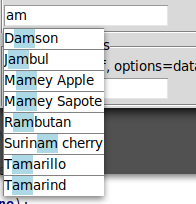

# MoreTk

## Autocomplete entry widget

    from moretk import Autocomplete
    Autocomplete.demo()

An entry widget that you can provide with a list of options. Options that match the current input in the entry will show up in a popup list. Options can be selected with keyboard or mouse. The popup can show outside of the normal window. 

    root = tk.Tk()
    Autocomplete(root, 
        options = None, # reuseable iterator of possible options for the user to choose from
        hitlimit = 10, # max number of hits to show
        limit_action = "warn" # One of "nothing", "warn", "scrollbar"
        func = "contains", # one of "startswith", "contains" or a custom function to use to determine if an option matches
        **kwargs) # kwargs passed on to the underlying Entry

## help please

Any screenshots, use instructions, documentation, bug fixes or other code improvement welcomed. Thanks. 
